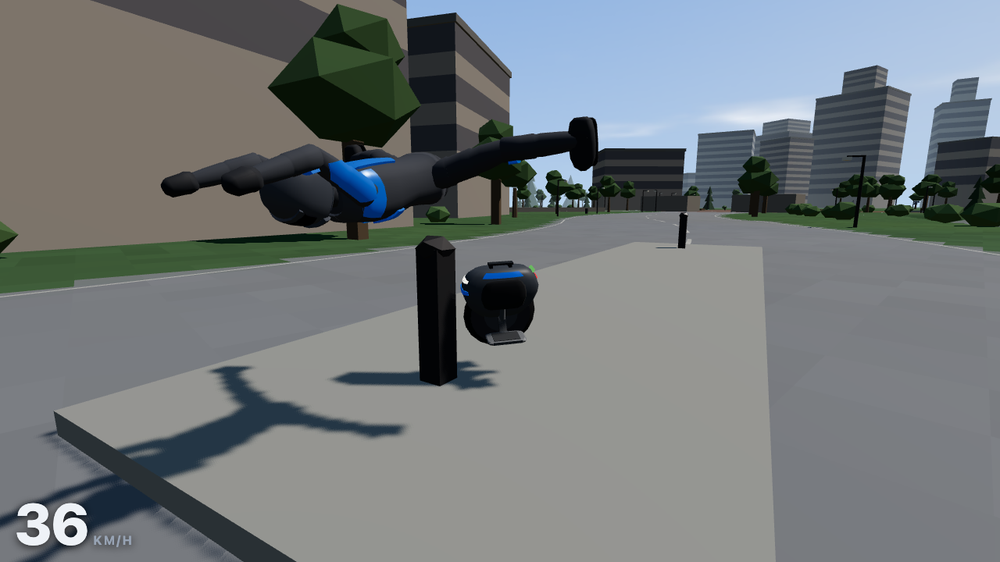

# EUC Thrills

**One wheel. Total freedom. Ride anywhere.**

An open-source arcade riding game about electric unicycles, played in the
browser. Lean into the throttle, carve a line through the city, hop a kerb, and
take the alley when you think you can hold it.

> **Play:** [https://vibezzzcoder.github.io/EUC-thrills/](https://vibezzzcoder.github.io/EUC-thrills/)
>
> **Source:** [github.com/VibezZzCoder/EUC-thrills](https://github.com/VibezZzCoder/EUC-thrills) — an original work by [VibezZzCoder](https://github.com/VibezZzCoder)

## ⚠️ This game is a work in progress

What you can play today starts with one complete hand-built city loop, then
opens into **procedurally generated Fresh routes** that can be ridden free or
against the clock. The city runs start to finish; the generated routes are
point-to-point. The riding is the part that is meant to be right — but this is
still the foundation of the game rather than the whole of it.

Worth knowing before you start:

- The hand-built city is still the default and the place the ride is tuned
  against. **Fresh route** uses procedural generation to build you a brand-new
  place to ride.
  Press **Surprise me** and it makes one — no typing, and that is the whole
  path. Every route also has a name, and typing the same name again always
  builds the same place, which is how you send one to a friend. A rare name may
  not produce a valid route, in which case the game says so and asks for
  another rather than quietly giving you a different world.
- **There are two riders now.** The title screen says who you are riding as and
  that line opens the chooser: **Cool Rider** in black and reflective blue, or
  **Trollina**, who has wild magenta hair, a skater dress over black tights, and
  her own idea of what falling off sounds like. Cool Rider is the first-time
  default; after you choose, the game remembers your rider. It is looks only —
  both ride exactly the same, and your best times carry across.
- **Phones and tablets ride it too**, on their own on-screen controls, in
  portrait or landscape. That is new, and it is the part of this build most
  likely to want adjusting on a handset nobody has tried it on yet — the size
  and the handedness of the controls are both in Settings.
- **Fresh routes now carry road hazards, and wobble is on.** Liquid spills and
  potholes appear on generated routes — visible, avoidable, and the only thing
  that can start a speed wobble. Ride over one and the wheel weaves until you
  slow down; carve as hard as you like on clean ground and it never will. The
  hand-built city stays hazard-free on purpose, so pedal strike remains the
  EUC-specific way to lose a ride there.
- **Your saved times may not survive every update — and this update is one of
  those.** Best times and ghosts are stored against the city or the exact
  Fresh-route seed they were set on; if a course or the save format changes,
  old records are left behind rather than silently converted into something
  they are not. Hazards changed what a Fresh-route seed builds, so times and
  ghosts set on seeds before this update no longer apply; city records are
  untouched.
- Things will look, sound, and handle differently in later builds. If the ride
  feels wrong somewhere — a control that fights you, a line that should work
  and doesn't — the repository linked above is the place to say so.

There is a [roadmap](#roadmap) further down.

*The screenshot shows the hand-built city, which remains the default world.
Fresh routes use seeded procedural generation to rearrange its authored riding
pieces. Both are drawn
by the game at startup, so the repository is small. It holds the page itself
(`index.html` with its built script and stylesheet under `assets/`), four sound
recordings — the only media the game loads — the gameplay screenshot above
under `media/`, the licence texts (`LICENSE`, `NOTICE.md`), a `.nojekyll`
marker, and `SHA256SUMS.txt`, a manifest listing the checksum of every
published file except itself.*

## Riding

You are **Cool Rider** or **Trollina**, on a fictional suspension wheel. The
two are the same to ride, down to the last number — the choice changes what you
look like and what you shout when it goes wrong. The default ride is a
loop that leaves a plaza, runs a boulevard, crosses a park and a river ford,
climbs a gravel trail, and comes back — with a shortcut through an alley that
is genuinely faster and genuinely riskier. Fresh routes reuse those authored
places in a procedurally generated point-to-point ride with a different shape
each time. Its seed makes that generation repeatable and shareable.

Some of what the wheel does is specific to a real EUC, and worth knowing before
it surprises you:

- **You lean to go.** The throttle tips the wheel forward and the wheel pushes
  back; there is no engine note to chase, only load.
- **The wheel tells you when it is running out.** Take the climb back to the
  plaza at speed and the machine's status light and the HUD warn you that you
  are asking for more than it has left. Push a wheel past that point and it
  tilts the pedals back to make you slow down — which is the real behaviour this
  is modelling, and the reason a rider watches the warning rather than the
  speed.
- **Watch your pedals in a hard carve.** Lean far enough and a pedal grounds,
  which costs you speed and, if you were fast, the ride.
- **On a Fresh route, watch the road itself.** A dark pothole or a wet spill is
  exactly what it looks like. A spill and a shallow hole set the wheel weaving —
  slow down and it settles; hold your speed and it grows until it puts you
  down. A deep hole at speed is simply a crash, and hopping clears any of them.
  Nothing else triggers the wobble: not speed, not rough ground, not the carve
  you are enjoying.

Crashes are non-graphic. After a spill you can ask to get going again with any
riding input once the tumble has settled, and the rider remounts on their own
shortly after if you do nothing — either way you are restored moving, not
stopped, so a crash costs you speed rather than the whole run.

## Controls

Three ways to ride, and **all of them are live at the same time**: a phone with
a pad paired to it, or a laptop with a touchscreen, does not have to choose.

### Touch — phone and tablet

The controls appear on their own on a touchscreen, in both portrait and
landscape. Rotating mid-ride is fine; nothing moves except the size of things.

| Action | Control |
|---|---|
| Accelerate | Push the floating stick up |
| Brake, and reverse from a standstill | Pull the floating stick down |
| Carve | Move the stick left or right — diagonal movement rides and carves together |
| Crouch, and charge a bigger hop | Hold **CHARGE** — the touch equivalent of `Shift` |
| Hop | Tap **HOP** — the touch equivalent of `Space`; hold **CHARGE** first for a bigger jump |
| Pause · quick reset · camera view | The three small buttons along the bottom |

The stick has no fixed spot: **put your thumb down anywhere on that side of the
screen and ride from there.** It follows your thumb rather than making you
find it. Up/down is the same forward/braking lean as `W`/`S`; left/right is the
same carve as `A`/`D`.

Three things in **Settings → Touch controls**: whether the controls are shown
at all (they work it out for themselves by default, and you can force them on
or off), a **left-handed layout** that mirrors the two sides, and a **size**
that scales the controls and both stick axes together — a bigger stick is a
gentler one, not a twitchier one.

### Keyboard

| Action | Keys |
|---|---|
| Accelerate | `W` or `↑` |
| Brake, and reverse from a standstill | `S` or `↓` |
| Carve left | `A` or `←` |
| Carve right | `D` or `→` |
| Hop | `Space` |
| Crouch, and charge a bigger hop | `Shift` |
| Quick reset — back to the start, or restart a timed run | `R` |
| Mute | `M` |
| Camera view | `C` |
| Pause | `Esc` |

Every key above except `Esc` can be reassigned in **Settings → Controls**.
`Esc` always pauses, and `F3`/`F4` open developer overlays.

### Gamepad

A standard controller works alongside the keyboard and the touchscreen — all of
them stay live at once, so you can put the pad down mid-ride and keep going on
the keys, or on your thumbs.

| Action | Control |
|---|---|
| Accelerate | Left stick forward, right trigger, or D-pad up |
| Brake / reverse | Left stick back, left trigger, or D-pad down |
| Carve | Left stick left and right, or D-pad left and right |
| Hop | A |
| Crouch, and charge a bigger hop | Left bumper |
| Quick reset | X |
| Camera view | Y |
| Pause | Start |
| In menus | Left stick or D-pad to move, A to confirm, B to go back; on the Fresh-route seed field, A rides the seed shown |

The stick dead zone is adjustable in Settings, and the pad can be switched off
there entirely. Face-button names are the Xbox layout; a PlayStation pad
reports the same positions (A is ✕, B is ○, X is □, Y is △).

## Modes

**Start ride** is free ride in the world currently loaded: no clock, no
objective, nothing to fail. In the city, ride the loop or ignore it entirely
and go and look at the river.

**Time trial** runs the current world against a start line and five more
checkpoints. The HUD points at the next one with a bearing and a distance; each
crossing shows the split and, once you have a time to beat, how far ahead or
behind it you are. The results screen breaks the run down leg by leg.

In the hand-built city, every checkpoint sits on ground both branches share,
so the alley shows up where it actually happens — as a faster leg — and a time
set the safe way is still comparable with one set through the alley.

Beat your own time and the game keeps the replay. The next attempt puts a
translucent rider on the course beside you, riding your best lap in real time —
which is the only honest way to see *where* you were slower rather than just
that you were.

Scoring is **pure elapsed time**. Top speed and landing quality are shown
because they are interesting, and count for nothing.

**Fresh route** uses procedural generation to build you a new place to ride.
**Surprise me** is the whole path if you want one now; the route it makes is
named, and typing that name in yourself always builds the same place. Ride it
freely or start its time trial.
The name stays visible and becomes part of the address, so sending the link
sends the same ground. Personal bests and ghosts stay with that route; they
never race on a different one — and they are kept per route, not per rider, so
switching between Cool Rider and Trollina changes nothing about your times.

## Riders

The line under the title screen's buttons says who you are riding as, and
opens the chooser. There are two, and the difference is entirely cosmetic:
**Cool Rider** in black moto gear with reflective blue panels and a full-face
helmet, and **Trollina**, who began life as a joke drawing somebody sent the
author to make fun of the graphics and ended up in the game. Each has their own
crash sound. Neither is faster.

## Settings

Quality, field of view, and speed units (km/h or mph); master, ride, and
warning volumes on separate faders, so the wheel can still warn you with
everything else turned down; full key rebinding; gamepad toggle and dead zone;
on-screen controls, handedness, and control size.

The ride itself is **identical at every setting** — nothing you can change
alters how the wheel behaves, so a time set on Low is comparable with a time
set on High, and a time set with thumbs is comparable with one set on keys.

## Saving, and your data

Your settings and your best times are saved **in your own browser** and go
nowhere else. There is no account, no server, and no analytics; the game makes
no network requests after it loads. Clearing your browser's site data for this
page clears your times with it — there is deliberately no in-game button that
can delete them by accident.

Every route keeps its best time. If many seeded routes eventually fill the
browser's storage, the game recycles the **oldest ghost replay first** and keeps
that route's time and splits. There is no storage inbox for you to manage.

In a private window, or with site data blocked, the game still runs and still
times you; it simply says up front that nothing will survive the tab closing.

## Requirements

A current browser with WebGL2 — Chrome, Edge, Firefox, or Safari, on a desktop,
a laptop, a phone, or a tablet. Hardware acceleration should be on; if the
browser cannot give the game a graphics context it says so on the loading
screen rather than sitting blank.

On a phone the game is doing the same work it does on a desktop, so an older
handset will run it slower. **Quality** in Settings is the first thing to turn
down, and it changes nothing about how the wheel rides.

## Roadmap

Direction, not a release schedule. There are no dates, the order is not a
priority list, and anything below the first group may change or never happen.

### Planned next

- **Something to swing at.** A new mode built around hitting scattered targets
  from the saddle at speed — whether whacking things mid-carve is fun is
  exactly what it exists to find out. That work has not started in this build.

### Recently landed

- **Wobble, redesigned, with readable road hazards.** Speed wobble was the
  missing third EUC risk, and it arrived the way the roadmap promised: paired
  with spills and potholes that can be seen and avoided, so it is recoverable
  and situational rather than the thing that ruins an ordinary carve. It is
  live in this build, on Fresh routes only.
- **Performance verification is complete.** Generated routes carry structural
  draw-call and triangle limits, and both the desktop and the handset ride
  checks are done.

### Ideas under consideration

- **More world.** Downtown streets, a hillside neighbourhood, an industrial
  edge, deeper woodland trail, more riverside — the urban-to-trail transition
  is the part the EUC exists for.
- **More to do.** Flow challenges that reward carving over braking, hill
  climbs, technical trail, downhill runs, checkpoint sprints with genuinely
  different lines, and a delivery ride that stays playful rather than becoming
  a job.
- **More ghosts.** Preset skill-level ghosts and a developer ghost to chase,
  beside your own.
- **A proper look pass.** The world is drawn entirely by the game rather than
  loaded from models, which leaves room to make it richer while keeping the
  generated-route budgets honest.
- **More wheels**, with real differences in character rather than a paint
  swap — and cosmetics for them.
- **More riders.** Whether a second rider handles differently or is purely
  cosmetic is still open.
- **Other cameras.** Helmet view, wheel-level view, a replay camera, a photo
  mode.
- **Music**, and a city with some life in it — people and movement you ride
  around rather than through.
- **More for the phone.** The controls are in and the game is properly
  playable on one; what is not there yet is anything that takes advantage of
  it — a layout that adapts to a folding screen, haptics on a landing or a
  pedal strike, or a way to keep riding with the screen off.

### Deliberately not planned

Online multiplayer, accounts, cloud saves, a story campaign, an in-game economy
or marketplace, and VR. Locally saved ghosts are how this game intends to do
competition, and the game asking you to sign in to ride is exactly what it is
trying not to be.

## Licence

Code is **MIT**. Original game assets are **CC BY 4.0**. Two of the five
shipped sounds derive from public-domain (CC0) recordings, one crash is the
author's own recording, and the second rider's crash is a composed one-shot
whose voice is machine-generated and is therefore excluded from the CC BY 4.0
claim. Full terms, attribution, and per-file provenance are in
[`LICENSE`](LICENSE) and [`NOTICE.md`](NOTICE.md).

The wheels in this game are original fictional designs. This project is not
affiliated with, endorsed by, or associated with any electric unicycle
manufacturer or retailer.
